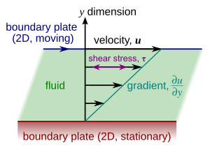

## 定义

受剪切力(不管多小的)就会连续地发生变形的物体称为**流体**.

## 基础假设:连续介质假设

我们认为流体的微团内已经有了足够的流体分子,使得统计均值有意义,且内部的空隙极小.于是我们不考虑流体内的空隙,认为流体是由流体微团来组成的,从而不考虑每个流体分子的运动情况.

## 流体的密度

密度就是单位体积下的质量,由于流体可能是分布不均的,**密度**被写成极限的形式

$$
\rho = \lim_{\delta V \to 0} \frac{\delta m}{\delta V} = \frac{dm}{dV}
$$

每个东西都有它独特的密度,记忆起来还是很麻烦的,而且数据又很大,所以我们如果能找到了一个基准就好了.
我们找到了常见的水的密度作为基准,为了避免反常膨胀之类的问题,我们取$4 ^\circ\text{C}$的水密度$\rho_{w}$作为基准,然后将两个密度作比就可以了,叫做某流体(与水的)**相对密度**$d$

$$
d=\frac{\rho_{f}}{\rho_{w}}
$$

上面我们讨论的是单一流体的情况,对于混合流体,其密度是以不同质流体占比$\alpha$为权的加权平均值,即:

$$
\rho_{混}=\sum_{i}\alpha_{i}\rho_{i}
$$

## 压缩性质和膨胀性质

流体受压会有体积变化,也就是说流体的压缩性质和压强和体积有关,于是我们将压强变化和体积变化率(注意不是体积变化量)联系起来,构成一个关于流体性质的参数,称为**压缩系数**.

$$
\kappa=-\frac{\frac{\delta v}{v}}{\delta p}=-\frac{\delta v}{v\delta p}
$$

有的时候我们也会用它的倒数,叫**体积模量**来描述我们的流体

$$
K=\frac{1}{\kappa}
$$

想让流体膨胀?那么升温就可以了!我们利用相似的构造方法,就能得到**热胀系数**$\alpha_{V}$

$$
\alpha_{v}=\frac{\frac{\delta v}{v}}{\delta T}=\frac{\delta v}{v\delta T}
$$

## 流体的粘性

### 牛顿(Newton)内摩擦定律

所谓流体的粘性就是指流体受到外界的剪切力作用的时候,它会不断地变形下去,在这种连续的剪切变形作用下的流体内部会产生剪切应力,这种性质称为流体的**粘性**.简单地思考就是,面团放在一个斜面(不是很斜)上,它虽然会沿着斜面滑下去,但是有很多时候它是变形了一点,然后停住了(黏住了),而同样的斜面倒一点水在上面就会很快地流下去(不考虑留附在斜面上的情况).**我们所考虑的就是这种内部的剪切应力对流动本身的阻碍**.
我们怎么样来描述这种对流动的阻碍呢,它与什么相关呢?牛爵爷做了下图的实验.

下面的壁不动,上面的动.我们刚才说过,流体会"黏"住给予切向力的上平板,也就是说此时移动的平板是受到阻碍的.现在我们要让上平板维持匀速地运动,要施加多少的力?(其实我们这里是把内力变成了外力哇!这是一个很有趣的转化思想)    
首先的应当了解的一点是:**流体会发生分层,每层的速度都不相同**.这种速度差产生了内摩擦力.  
牛顿发现了一些流体的一些特殊的性质,**面积越大,内摩擦的阻碍就越严重.物质越黏,当然内摩擦也就越大,离得越近,内摩擦也就越严重,想要维持的移动速度越快,内摩擦也越严重.** 所以牛顿构建了这样一个关系式:

$$
F=\frac{\mu Av}{h}
$$

其中$A$是面积,$v$是上板运动的速度,$h$是两板间距.而$\mu$是一个比例系数,与流体的性质有关,称为**动力粘度**(简称粘度.)
我们有的时候只分析单位面积上的切向力,又叫**切向应力**,符号为$\tau$，切向应力的量纲是$[\text{M}\cdot\text{L}^{-1}\cdot\text{T}^{-2}]$

$$
\tau=\frac{\mu v}{h}
$$

我们注意到,上面的式子认为速度随着 y 方的变化是常数,也就是说坐标和流速是成线性的关系,实际上,也可以不成线性的关系.但是事实证明,剪切力的大小总是和**速度对垂直流动向坐标的梯度大小成正比.**

$$
\tau=\mu \nabla_{y} v=\mu\frac{dv}{dy}
$$

为了纪念牛顿的贡献,我们叫上面的关于剪切力的方程为**牛顿内摩擦定律**.
动力粘度和密度的比值也是一个常用的物理量,称为**运动粘度**$\nu$

$$
\nu=\frac{\mu}{\rho}
$$

$\nu$的量纲是$[L^2/t]$,也就是$\text{cm}^2/\text{s}$,又叫**斯托克**(纪念数学家,物理学家斯托克斯)

### 非牛顿流体

#### 奥斯特瓦尔德－德沃尔定律和幂律流体

实际上,不是所有流体都满足牛顿内摩擦定律,满足的叫牛顿流体,不满足的叫**非牛顿流体**.
比如蜂蜜.非牛顿流体的剪切力与速度的关系相对复杂,产量更多,不便研究
尽管如此,工程上经常以**幂函数模型**来作为非牛顿流体的简单近似,服从这种近似的流体称为**幂律流体**,对于幂律流体的一维流动,我们认为它的应力满足**奥斯特瓦尔德(Ostwald)－德沃尔(de Waele)定律**
$$
\tau_{yx} = k \left( \frac{d u}{d y} \right)^n
$$
其中$k$称为稠度指数,$n$为流动特性因数.
当$k=\mu,n=1$时,上述的流体退化为牛顿流体.
当$n<1$时称为**拟塑性流体**(剪切稀化,_例子是番茄酱_),$n>1$称为**胀流性流体**(剪切稠化,_例子是油漆_),有时候为了将$\tau_{yx}$的符号和剪切速率同步,也是为了和内摩擦定律有相同的结构,我们会将它写成下面的形式

$$
\tau_{yx}=\eta\frac{ du}{dy}
$$

其中$\eta=k| \frac{du}{dy} |^{n-1}$,我们也叫它粘度,为了区分,称它叫做**表观粘度(国外)**.
??? ad-warning "表观粘度的争议"
    在我校的孔珑书上表观粘度直接被定义为上文的比例常数$k$,而不是这里的$\eta$,注意定义并不相同.完成作业时以孔书为准,其他情况以完成项目时的指导为准,本书以所写公式为准.

#### 宾厄(Bingham)流

就算我们把幂律流体近似模型拿出来,还是不得不问一个问题?牙膏是不是流体.根据流体的定义,当我们挤压牙膏棒(也就是加一个剪切力)的时候,牙膏确实会向前滑移,所以它是流体.可是我们发现当我们撤去剪切力的时候,牙膏又会缩回去.这说明,牙膏在剪切力小于某个值的时候的时候又表现出塑性固体的特性.也就是,牙膏有自己的"屈服应力"
Yugene Bingham 率先提出了这种流体的数学方程:
$$
\tau = \eta \frac{dv}{dy} + \tau_0
$$
其中的$\tau_0$就是最小的屈服应力,低于$\tau_{0}$的剪切应力将不会使 Bingham 流体流动.

#### 触变流

有些时候,非牛顿流体的剪切应力还和解出的时间有关,代表性的就是流沙这类的触变流体,不过这部分的研究不在我们讨论范畴中

### 粘度和温度的关系:萨瑟兰(Sutherland)定律

一般而言,粘度和温度之间是有关系的,当压强不是很大的时候.粘度和一串关于温度的函数成正比,一般写成:

$$
\mu=b \frac{T^{1/2}}{1+\frac{S}{T}}
$$

其中$b$是一个比例系数,$S$为**Sutherland常数**.
这个形式有的时候并不出现在某些流体力学书上,它们会写成
$$
\mu = \mu_0 \frac{273 + S}{T + S} \left( \frac{T}{273} \right)^{3/2}
$$
这是怎么来的呢?我们其实就只是令$T_{0}=273 \text{K}$,反求了$b$
$$
b = \mu_0 \cdot \frac{1 + \frac{S}{T_0}}{T_0^{1/2}}
$$
带回原式子,一顿操作(分子分母同乘上$T\cdot T_0$)
$$
\mu = \mu_0 \cdot \frac{1 + \frac{S}{T_0}}{T_0^{1/2}} \cdot \frac{T^{1/2}}{1 + \frac{S}{T}}
$$
$$
\mu = \mu_0 \cdot \frac{T_0 + S}{T + S} \cdot \left( \frac{T}{T_0} \right)^{3/2}
$$
代入$T_{0}=273 \text{K}$,得到:
$$
\mu = \mu_0 \cdot \frac{273 + S}{T + S} \cdot \left( \frac{T}{273} \right)^{3/2}
$$
这下认识了,是书上的 Sutherland 定律了.Sutherland 常数的单位是$\text{K}$.
但是 Sutherland 定律只适用于压强不是很大的时候.
习题:[[孔书-例2-3]]

### 混合气体的动力粘度

混合气体的动力粘度公式如下:
$$
\mu = \left( \sum_{i=1}^{n} \alpha_i M_i^{1/2} \mu_i \right) \Bigg/ \left( \sum_{i=1}^{n} \alpha_i M_i^{1/2} \right)
$$
可以见到它是对$\mu_{i}$的加权平均,断开和式子
每个加权项目是$\displaystyle\frac{\alpha_{i}M_{i}^{1/2}}{\sum_{i=1}^{n} \alpha_i M_i^{1/2}}$

