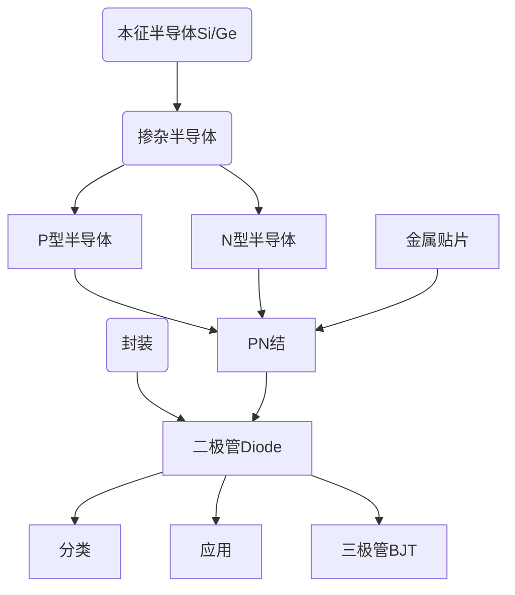

```mermaid
flowchart TD
    n1["本征半导体Si/Ge"] --> n2["掺杂半导体"]
    n2 --> n3["P型半导体"] & n4["N型半导体"]
    n3 --> n5["PN结"]
    n4 --> n5
    n6["金属贴片"] --> n5
    n7["封装"] --> n8["二极管Diode"]
    n5 --> n8
    n8 --> n9["分类"] & n10["应用"]
    n8 --> n11["三极管BJT"]

    n1@{ shape: rounded}
    n2@{ shape: rounded}
    n6@{ shape: rect}
    n7@{ shape: rounded}


```

