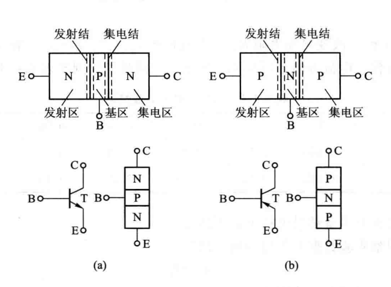
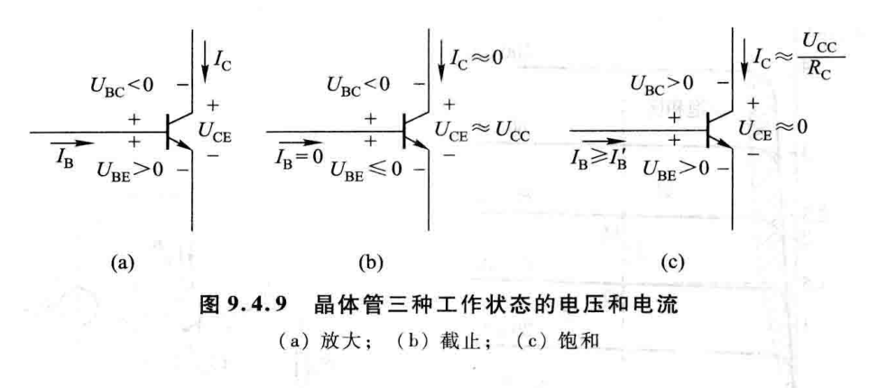

# 三极管(1):三极管速通

## 什么是三极管

如上图所示的电子元件叫做晶体管,一般也叫做三极管.  
之所以叫三极管,就是因为他**有三个电极**呗.我们看上面的右图.发现上面标上了$B,E,C$三个字母,这其实分别对应三极管的 **基极(Base),发射极(Emission)和集电极(Collector)** 的缩写.这些电极上所加的电势不同,三极管的功能也不同.

我们可以说,这种长得像三明治的结构,就是三极管.那么这个三明治的内馅可以是两种掺杂半导体的任何一种,所以我们的三极管有两种,**NPN型**和**PNP型**三极管.如下图所示:

我们看,对于三极管的电路图而言,总是自上到下画出C,B,E三级.那么怎么区分两种不同的夹心方式呢,我们发现,电流总是$P\to N$,而两种三极管的电流方向并不一样,所以我们就**标出三极管的电流方向来区分不同的两种三极管**.

## 三极管的性质和作用

### 电流关系

对于三极管而言,它不仅可以起开关的作用,也可以起放大的作用.不过不管哪种作用,下面的情况总是满足的.
$$
i_{E}=i_{B}+i_{C}
$$
这是三极管满足**基尔霍夫电流定律**的基础条件.

### 放大关系

实验数据同时表明,$\frac{i_c}{i_b}$是一个有关三极管本身性质的量.我们称之为三极管**共发射极直流(静态)放大系数**$\bar{\beta}$(名字真jb长).  
我们看到这个小横杆,它并不表示*平均*,而是**直流**.  
假如我们不是静态地处理这两者的比值,而是去求它们两个物理量的差商,就能得到**共发射极交流(动态)放大系数**$\beta$.  

要使我们的三极管处于放大的状态,还需要满足下面的电势关系:

- NPN:$V_{C}>V_{B}>V_{E}$,基极比发射极高$0.6\sim 0.7 \text{V}$,$\ce{Si}$管
- PNP:$V_{E}>V_{B}>V_{C}$,基极比发射极低$0.2\sim 0.3 \text{V}$,$\ce{Ge}$管

### 何种工作状态

给定如下的三极管图示.

- 截止:同负,$U_{CE}$近似$U_{CC}$
- 饱和:同正,$U_{CE}$近似$0$
- 放大:一正一负.

还有一种做法,负的就是截止,然后你把最小饱和电流算出来$i_C/\bar{\beta}$,比它大就饱和,比它小就放大.

