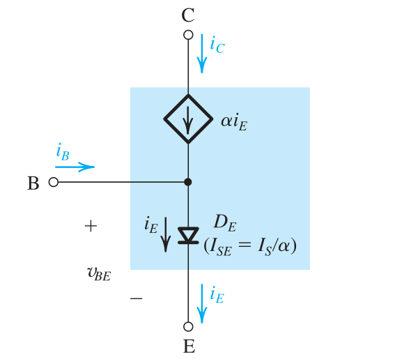
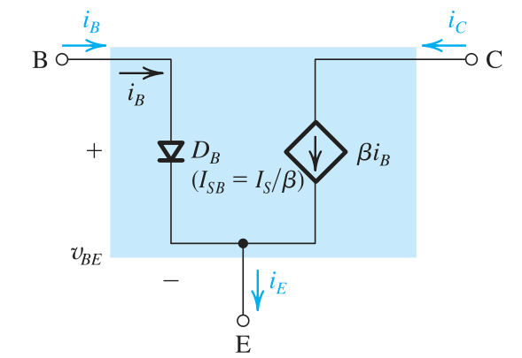
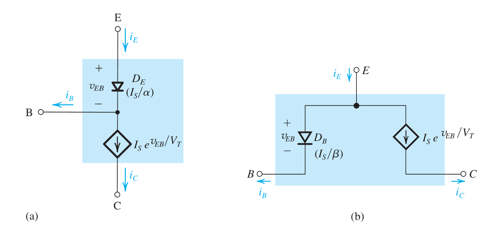

# 一起认识BJT管(01):BJT管的类型和基础性质

## BJT管的结构和内部条件

前面讲解二极管的目标是为了能够利用单向导电性来实现我们的各种目标.之所以我们要讲解BJT管,主要的目的是要利用其**放大**的特性.  
不得不提起我们先前在[引言](https://rougamorika.github.io/analog/)中提及的*模电的核心研究对象是放大器*的暴论,那么我们自然就要研究具有放大功能的元件了.  
**三极管(Triode)**是一个有**放大器功能**的真空管,在真空的玻璃外壳内有三个电极:一个加热的灯丝(阴极),控制栅格以及金属平板(阳极).

!!! info 真空管
    此时我们研究出来的三极管是一个超级大的玩意,叫做**真空管**!!!而不是我们马上要分析的BJT管(一般也叫做双极性**晶体管**),我们现在研究的电子元件一般来说都是晶体管而非真空管,所以我们称真空管实现的放大器件为三极管(Triode),称晶体管实现的放大器件为**BJT**.

在贝尔实验室的科学家们的努力下,我们革新了真空管,转而通过半导体材料来实现放大功能,晶体管踏上了历史舞台,也就是BJT.  
我们来研究BJT管,它的一种实现方式如下.
.svg.png)
这种实现方式的BJT管称之为 **NPN 管**.这很直观,P型半导体以一种*三明治*的样子夹在了两个N型半导体之间.  
根据我们上一个部分学习的内容,P,N两种半导体如果放在一起,就会形成一个PN结.所以上面的BJT管的内部有两个PN结.我们对两个N型半导体作完全不同的工艺处理.下面是我们的处理方法:

- $\text{N}^{*}$部分,这个部分我们注入及其高浓度的载流子(电子).
- $\text{P}$部分,这个部分载流子尽可能稀,并且半导体的宽度足够地薄
- $\text{N}^{+}$,这个部分的载流子浓度尽可能的少.

之所以我们使用载流子这个名词,是因为我们只是以 **NPN 管**这样一个实现方式告诉你**BJT**管的工作方式,还有一种实现方式是两个P型半导体夹住一个N型半导体,称之为 **PNP 管**.不管哪种实现,上面的三条都是满足的,称之为**BJT管放大的内部条件**,上面的三个部分分别有自己的名字

- $\text{N}^{*}$部分,称之为**发射极**(E),取自英语*Emitter*.
- $\text{N}^{+}$部分,称之为**集电极**(C),取自英语*Collector*.
- $P$部分,称之为**基极**(B),取自英语*Base*.

### BJT管的外界放大条件

BJT管如果想要放大输入的信号,除了满足上面的内部放大条件(物理条件),还需要满足外部的放大条件(偏置条件).这个条件非常好记忆:**发射结正偏,集电结反偏**.  
现在我们来简单解释一下上面的口诀的缘由,这里的解释是定性的,而不是定量的,我们这里并不讨论定量的描述.

.svg.png)

如上图所示,我们的NPN三个掺杂半导体构成了两个PN结:

- 集电结:靠近集电极的PN结
- 发射结:靠近发射极的PN结

#### 满足两个条件为何能够放大信号?

由于我们现在使得发射结正偏,那么发射结N型掺杂半导体里的电子就会往P型漂移,于此同时,P型半导体里的空穴也向N型半导体漂移,**注入基区**.在这个过程中还有一部分空穴和电子结合掉,从E端子的视角来看,就会有一个从P到N的电流$i_{E}$(发射极电流).  
现在来看P区域的情况,由于先前的漂移和结合,P区的空穴浓度有所下降,这给PN结外部的空穴向P区内部扩散创造了条件,于是P区会从基极"抓取"空穴",进而从基极的视点来看,就是基极电流$i_{B}$流入PN结.  
基区很薄,这意味着高浓度注入的电子会很快地接近集点结,这个时候集电结的反偏电场会帮助P区的少数载流子(就是高浓度的电子)加速穿过集电结,进而离开低浓度N区域(不仅是加速,而且还和浓度扩散同向),形成集电极电流$i_{c}$.同时,阻止P区的空穴穿过结,更多地与少数载流子结合,进而增强$i_{B}$.

#### 只能是上述的条件吗?

对于别的情况,我们也来做做分析:

##### 发射结反偏(BJT截止状态)

如果让发射极反偏,那么自然地,此时电子就不会注入基区.因而你只能看到极其小的$i_{E}$(此时它近似于结反向电流).此时集电极也几乎无电流,如果集电结也反偏,基区可能会有相对更大的电流(因为是集电极和发射极共同贡献的).  
不管怎么说,这个时候BJT的三个极都只有漏电流,我们称这时候BJT处于截止状态

##### 发射结正偏,集电结也正偏(BJT饱和状态)

此时两个电流都是有的,似乎和放大条件很像?
当两个结都正偏时，发射区的载流子注入基区后，由于集电结也正偏，集电区的电位相对于基区较低，无法形成足够的电场来吸引和收集从基区扩散过来的载流子。这会导致载流子在基区的复合增加，无法有效到达集电区，从而破坏了载流子的传输机制，使得有效的放大作用无法实现.

### 基础关系和放大倍数

经过实验,我们发现:
$$
\color{#EE6363}{\frac{i_{c}}{i_{b}}}
$$
是一个**定值**.称为放大倍数,一般记作$\beta$即
$$
\color{#EE6363}{\beta=\frac{i_{c}}{i_{b}}}
$$
在这样的条件下,假设我们对三极管本身动用Kirchoff定律,那么自然有:
$$
\color{green}{
i_{E}=i_{b}+i_{c}}
$$
并且代入上面的公式,得到
$$
\color{CornflowerBlue}
{i_{E}=(1+\beta)i_{b}}
$$
通过半导体物理的知识,我们能知道:
$$
\beta=\frac{1}{\frac{D_{p}}{D_{n}}\frac{N_{A}}{N_{D}}\frac{W}{L_{p}}+\frac{1}{2}\frac{W^{2}}{D_{n}\tau_{b}}}
$$
和晶体管有关,与外加的偏置无关,并且我们也能看出来,如果我们想要较高的放大倍数,则就需要薄基区(让$W$变小),发射区重掺杂($\frac{N_{A}}{N_{D}}$减小).

我们很多时候不仅考虑放大倍数$\beta$,还考虑一个和$\beta$强相关的量:
$$
\color{#EEB422}
\alpha=\frac{\beta}{\beta+1}
$$
这被称作**共基电流传输系数**,之后会大量地用.

## BJT管的大信号模型

### NPN管

#### $i_{e}$为理想二极管的串联型模型

我们上面的推导告诉我们,实际上在放大倍数很大时候,$i_{b}$和$i_{c},i_{e}$几乎是可以忽略不计的,并且根据上面的推导,我们可以知道
$$
\color{blue}{i_{c}=\alpha i_{e}}
$$
因而我们可以怎么处理?**我们可以把$i_{c}$视作被$i_{e}$控制的受控电流源**.如下图所示:

#### $i_{b}$为理想二极管的并联型模型

还有一种做法不是使用$\alpha$,而是使用$\beta$来实现,此时$D_{B}$上的电流一般为:
$$
I_{sB}=\frac{I_{s}}{\beta}
$$
此时:
$$
I_{c}=\beta i_{b}
$$
它们的和是$i_{e}$

### PNP管

[放大器的计算实例]

