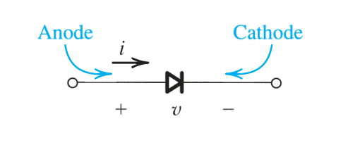
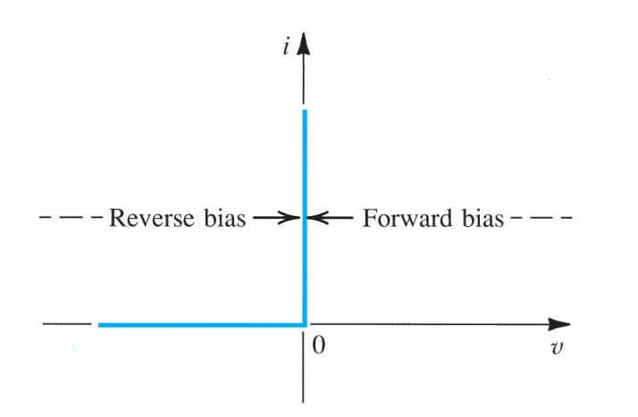
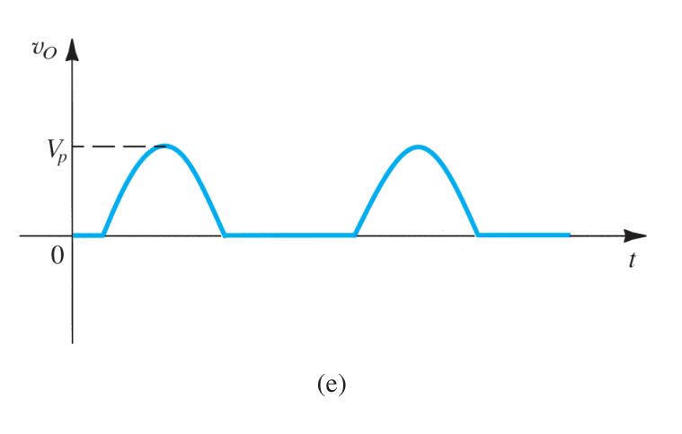
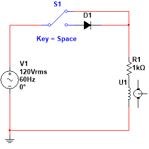
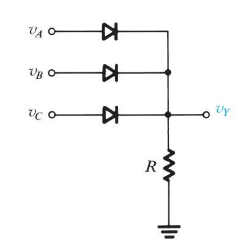
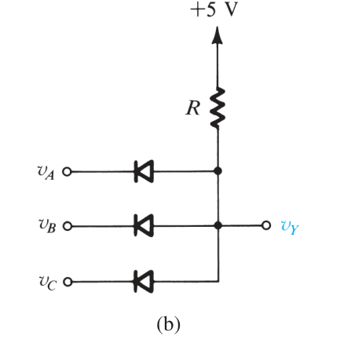

## 理想二极管

### 理想二极管的电路特性

我们现在来研究一种特殊的电路元件,称为**二极管**(Diode),它和我们上一节所研究的PN结之间有一些联系.不过我们现在先独立地来介绍这个电子元件.

如图所示是二极管的电路符号,它处于一个开路中.每一个二极管都有两个端子,一个称为阳极,另一个称为阴极,二极管的电路符号的三角形朝向总是从阳极指向阴极.
如何判断理想二极管的两极,需要先介绍**理想二极管的I-V曲线**.如下图所示.

如图所示,当理想二极管得以通过电流,并且自身不造成任何压降的情形,被称为加**正向偏置**.加正向偏置的理想二极管的电流从二极管的**阳极流向阴极**.此时我们就判断了二极管的两极.我们将这个状态称为二极管的**导通态**.
当我们将外加电压的极性调转,此时无论加多大的电压,**二极管上都无电流**.我们将这个状态叫做二极管的**截止态**.
可以这样认识到:二极管在加正向偏置的导通态表现为短路,在加反向偏置的截止态表现为短路,这种状态类似于**开关**,它是理想二极管的一个用途.
理想二极管的I-V曲线虽然不是线性的,但是假如我们将正向和反向区分开,此时每个单独考虑的分段都是线性的.我们叫这样的I-V曲线为**分段线性**的.

### 理想二极管的应用

我们现在来谈一谈理想二极管的一些应用.

#### 整流电路

我们现在有如下的通交流电的电路:

![[Pasted image 20250303132447.png|550]]

此时我们注意到,当交流正弦电压为正时,此时理想二极管表现为导通,即为导线,当为负时,二极管表现为截止.实际上,我们可以认为,$v_{0}$丢失了一半的波形(负半区),这是二极管的**整流作用**.如下图所示

丢失了一般波形的电路能有什么用呢,我们用Multisim绘制一个这样的电路图,你就明白了.

这是一个电吹风的风力调节装置的电路实现,当我们想要高档位时,我们就将SPDT开关打到无二极管的支路,输出的波形是完整的,电动机全功率运行.而当调至低档位的时候,我们就将开关打到含二极管的支路,从而只在正电压时刻输出波形,进而限制电动机的输出.
那怎么就***整流*** 呢,什么是整流??
所谓的整流,就是对给定的**交流信号**进行一定地处理,从而输出**直流信号**,即**交$\to$直**.
在这里我们通过对负半周波形的整流,将原先的交流电转化成了**脉动直流电**,进而实现了交转直.  
*那么古尔丹,代价是什么呢?*  
我们**损失了一半的波形**,即我们的脉动直流电的频率只有原来的一半,我们也损失了一半的能量.而且,**脉动直流还是不能用**,得做滤波才能变成我们常用的直流(并一个电容/串一个电感,之后会说.)

#### 二极管实现逻辑门*

*之所以打星号,是因为A:逻辑门基本是数电研究的内容,这里只是介绍电路结构.B:数字电路逻辑门一般现在都用通用门(一般是NAND门)*  
现在我们来研究逻辑门,我们一般从布尔代数的角度来介绍逻辑门,这一点在数电的课程当中会更详细,我们目前只要知道,**数字电路不在乎电压的大小,只区分电压的高低**.

##### OR门

如图所示是一个**三路或门**的电路实现,我们假设三个二极管都是理想的二极管.注意到,我们输入的$v_{a},v_{b},v_{c}$只要有一路是高电平$v_{H}$,那么就一定能使低电平$v_{L}$的支路上的理想二极管**截止**(因为此时加在这个管子上的电压$v_{L}-v_{H}<0$).进而使得$v_{Y}$输出高电平.
这个逻辑是**有高则为高**,所以这是**或(OR)门**.
换个角度思考,只要有一路是通的,那么我们就输出通.

##### AND 门

我们现在考虑这个模型, 假如给定的三个二极管,只要有一个低电平,那么低电平对应的二极管就会导通.那么我们自然就会得到输出端是**0V+管压降**(因为电阻要分压).所以此时输出的$v_{y}$是低电平.
因此,如果这个时候我们要输出通,则必须三个二极管都导通.

二极管不能实现通用逻辑门,这是因为我们不能用二极管实现反相,进而不能实现非门.
