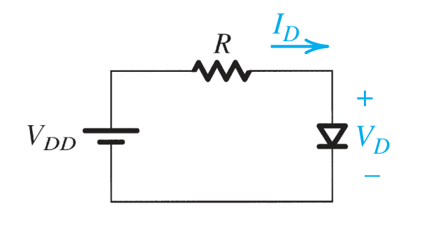
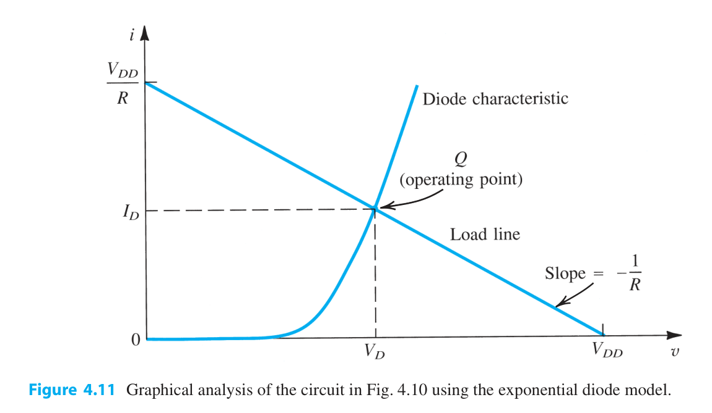
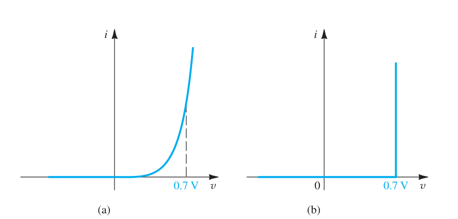

# 二极管入门(2):实际二极管的实现和建模

## 实际二极管的实现:PN结

### PN结端子特性

我们这个部分来聊一聊二极管的实际实现.基本上,我是说基本上,连小孩子都知道二极管就是用PN结做的.  
问题是,你了解PN结嘛?  

#### PN结之回顾

我们现在来回顾一下PN结的特性

- $V>0$,此时加的正向电压,导通,$I-V$曲线为$i=i_s(e^{v/V_{T}}-1)$
- $-V_{ZK}<V<0$,此时加的反向电压,截止,电流为饱和电流$i_s$
- $v<-V_{ZK}$,此时PN结被击穿.

对上面的一些量值,我们要有一定的认识:
$$
V_T=\frac{kT}{q}
$$

#### 对偏置的研究

对于我们正向偏置的$I-V$关系,随着我们的$e$指数的不断扩大.后面的常数项$-1$的影响不断减小,因而我们可以说下面的条件是成立的:
$$
i\simeq i_s e^{v/v_{T}}
$$
那么我们自自然可以改写下上面的函数
$$
\log(i)=\log(i_s)+\frac{v}{v_{T}}
$$
因而
$$
v=v_{T}\log(\frac{i}{i_s})
$$
那么我们可以发现,对于在正向偏置区的PN结来说:
$$
V_2-V_1=v_{T}\log(\frac{i_2}{i_1})
$$

### 对正向特性的建模

#### 指数模型

##### 方程组

我们刚刚就对我们的$-1$信号做了忽略,所以我们自然认为,对于实际的二极管,我们应当采取这种指数模型来建模.  
我们先看到最简单的正偏二极管的电路图:

我们首先假设我们的外加正向电压大于我们的管压降.此时根据我们上面的分析,我们可以认识到:
$$
i_{D}=i_{s}e^{V_{D}/V_{T}}
$$
并且根据我们的Kirchoff定律,我们还有:
$$
i_{D}=\frac{V_{DD}-V_{D}}{R}
$$
通过上面的两个方程,我们就可以在已知$i_s$的情况下,反解出$i_{D}$和$V_{D}$.

##### 图解法,工作点

解答上面这个方程组可以通过将两张图像都绘制在我们的$i-v$坐标系上面.

我们自然也就能画出上面的两根曲线,结局就是,我们能够画出一个交点,这个叫交点我们称之为**工作点**.

##### 迭代法求工作点

#### 压降模型

我们不喜欢非线性的元件(尤其是这种指数的),因为一旦联立起来就是*超越方程*.这个玩意超级难解!!!  
我们参考我们之前的理想二极管莫模型,它的导通压降是0,那么我们引入$0.7\text{V}$的导通压降就可以了嘛.下面的图像很好地阐释了这一点

#### 理想二极管模型

如果我们的正向压降相较于我们的外加电压非常小,那么自然地我们就可以忽略正向压降的影响,此时压降模型可以直接转化为理想二极管模型.

#### 小信号模型(重要)

现在我们还是回到这样的一个电路图.

上面的两个模型在处理二极管的时候,都把它当成了反向直流电源了.这在算工作点和算功率,还有算频率响应的时候都会出问题.
所以我们提出一种新的模型,假设我们的直流正向电压源$V_{DD}$ 改变了,改变成了 $V_{DD}+\Delta V$.        

