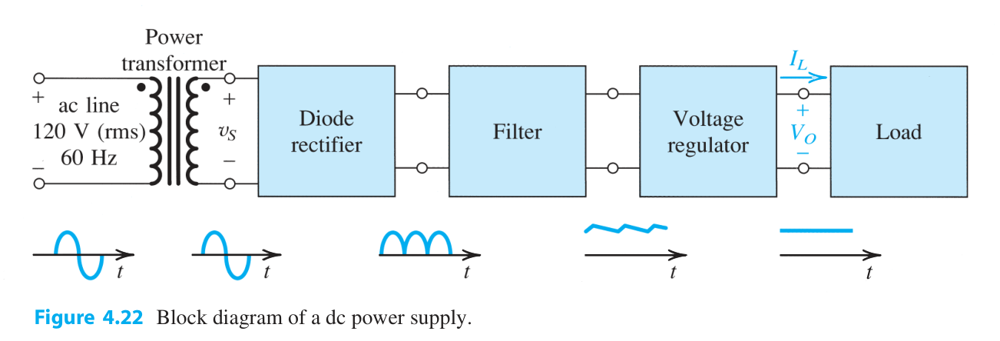
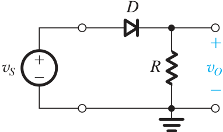
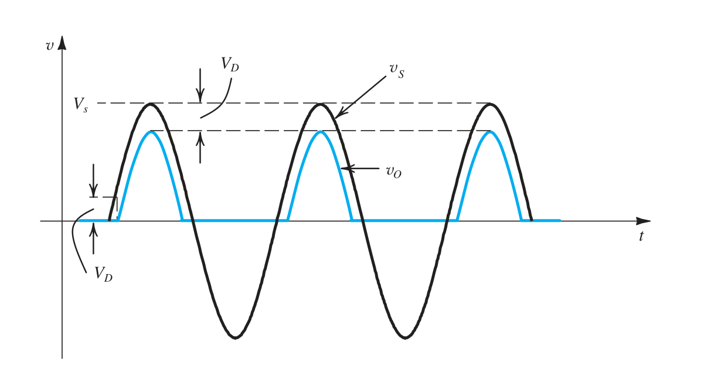
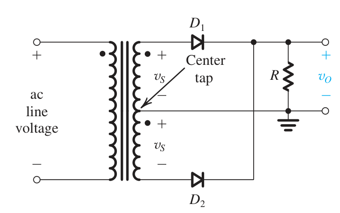
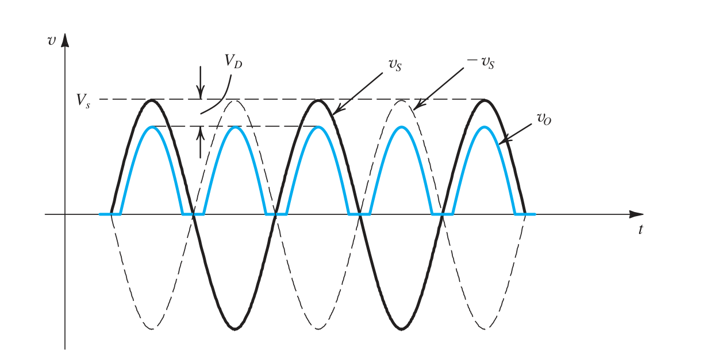
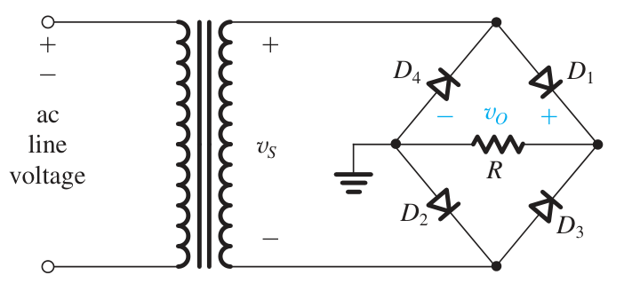

# 对整流电路的初步介绍

理论上,这部分应当作为二极管的一个重要的实例放在扩展包里.  
但是如果一个模电的笔记都敢于将整流电路放在"扩展包"里,那么这个模电笔记的内容也太贫瘠了一点,现在我们先初步地利用我们现有的元件,实现一下**整流**的工作吧.

## 整流是什么?

众所周知,我们现在通过电网输进来的电都是交流电.然而,我们的负载却几乎都是直流负载,我们的交流电直接加在这些负载上有很大的可能损坏我们的负载,造成经济损失和安全隐患.  
我们自然想到,**把交流电变成直流电**,再加到负载上,这事不就解决了嘛!我们把这个过程叫做**整流**.
就这么简单?就这么简单.

## 如何整流?请看 DC 电源

我们的负载一般而言都需要电源来供电(_用电池的给我除去_),电源给负载供电的流程图和输入的波形一般如下所示:

我们的负载要求电压一般而言也不是$220\text{V}/120\text{V}$,而是十几伏到几十伏.此时我们就要掏出:  
**_变压器!!!!!!!!!!!!!!!!!!!!!!!!!!!!!!!!!!!!!!_**(Transformer)

现在,我们通过变压器将我们的电压的幅值从 $120\text{V}$ 变为了 $v_{s}$.但是此时我们的输入信号还是交流的,因而还是不能加在负载上面.此时我们就要把原来的信号通过二极管整流器进行**整流**(Rectifying),将有正有负的交流电信号整流为脉动直流电,并利用电容器/电感器进行滤波(Filtering),此时我们已经近乎得到直流电了,但是还是会有一些交流的"噪声",称为**纹波**(Ripple).这时候我们再加上一个稳压器,就可以输出直流电了.  
变压器的部分我们在电工技术中已经说过很多了,它并不属于电子技术的范畴.剩下的部分我们就会在电子技术中一一介绍,即**整流器**,**滤波器**和**稳压器**,统统学习过后,结合我们之后会学习的 BJT 管,MOS 管和已学习的二极管,我们应当自己可以制作一个电源出来.

## 整流电路

### 半波整流电路(Half-Wave Rectifier)的构成

现在我们来介绍最方便实现的整流电路,大家已经在理想二极管的应用中见过它的一个简化形式(此时二极管是不考虑压降的).如下图所示:

那么大家基本都知道了这个电路会吃掉负半部分的波形.因为我们现在考虑的是实际二极管,所以还要考虑最小的**导通电压**,那么低于最小导通电压的正向电压也会被视作截止,输出的波形如图所示.

由于我们在波形负半区的情况下,二极管是属于截止状态的,所以我们此时二极管受到的反向电压的绝对值就是波形的峰值电压 $v_{s}$ ,这很危险,一不小心就会击穿我们二极管,所以我们将它作为一个重要的参量,称为**PIV**(Peak Inverse Voltage,反向峰值电压).此时

$$
\text{PIV}=v_{s}
$$

**出于安全的考量,我们至少要选一个击穿电压大于 PIV$50\%$的二极管作为我们的整流器件**.  
更大的问题是,面对$100\text{mV}$这样小的待整流信号,**这个电路是不行的**!

### 全波整流电路(Full-Wave Rectifier)的构成

半波整流电路的一个大问题就是丢失了一半的波形,因而周期数发生了减半,进而丢失了一半的能量.**这很浪费**.为了能够让我们能够节约能源,我们做了一种新的电路,进而能够不切削负半区的波形.如下图所示:

我们首先是在次级线圈绕组的中心点上做一个抽头出来,这个抽头可以将我们的输出信号变为两个完全相同的信号$v_{s}$.  
当 $V_{s}$ 通过正半区时,上半部分$V_{s}$通过$D_{1}$,此时$D_{1}$是正向导通的,他会通过负载,给它正向的电压,而通过引线对$D_{2}$截止.此时就回到中心零点.  
当 $V_{s}$ 通过负半区时,上半部分的 $D_{1}$ 被截止,$V_{s}$通过走八字通过负载,此时负载上的电压还是正的.这样我们就实现了两个半周整流的目的.输出信号如下所示:

那么此时的 PIV 是多少呢??利用上面的分析,我们的截止管不仅要承受本侧 $v_{s}$, 还要承受导通侧的$v_{s}-v_{0}$,因此,此时的 PIV 自然为:

$$
\text{PIV}=2v_{s}-v_{0}
$$

如果$v_{s}$很大,PIV 也将大的离谱.这是全波整流电路的第一个缺点:**对二极管的反向截止电压要求太高**.这说明它只适用于小信号的整流.  
全波整流电路的第二个缺点是:**这个中心抽头不是很好做**.如果匝数不相等,我们上面的大量分析就会出问题,这个时候可能该截止的玩意就导通了.如果中心头的焊接不牢,可能会容易漏电等等.

### 桥式整流电路(Full-Bridge Rectifier)的构成

为了解决上面的问题,我们从 Wheatstone Bridge 的电路中得到灵感(Wheatstone Bridge 是电路分析的内容),构建起了**桥式整流电路**,如下图所示:

当我们正半周通过时,此时$D_1$,$D_2$导通,$D_3$,$D_4$截止.流过电阻$R$上的电流自图右向图左,记此方向为正向.  
当我们负半周通过时,此时$D_3$,$D_4$导通,$D_1$,$D_2$截止.流过电阻$R$上的电流依然自图右向图左.从此,我们实现了整流的目标.  
由于我们的现在一个半周要过两个管子,所以输出的电压其实是$v_{s}-2v_{d}$.但是我们注意到,此时的截止管只要负责hold住自己旁边的管子了,此时PIV是:
$$
\text{PIV}=v_{s}-v_{d}
$$
另一个好处在于,我们不再需要用两倍的绕组来实现相同的电压输出了.

### 峰值整流器

