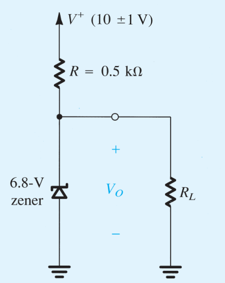

# 利用Zener管实现并联稳压器

我们来看如下的一个电路:

如图所示的$\text{6.8V}$齐纳二极管,在\(I_Z = 5 \, \text{mA}\)时\(V_Z = 6.8 \, \text{V}\)，\(r_z = 20 \, \Omega\)，和\(I_{ZK} = 0.2 \, \text{mA}\).电源电压\(V^+\)有额定值为10 V,但可能有±1 V的范围的浮动

(a) 求无负载且\(V^+\)在其额定值时的\(V_o\)。

(b) 当\(V^+\)有$\pm \text{1V}$变化时\(V_o\)的变化.补充:\((\Delta V_o / \Delta V^+)\),单位为$\text{mV/V}$,称为**线性稳压性**。

(c) 接上负载电阻\(R_L\),其上电流\(I_L = 1 \, \text{mA}\).求此时\(V_o\)的变化,并求**负载稳压性**\((\Delta V_o / \Delta I_L)\),其单位为mV/mA.

(d) 当\(R_L = 2 \, \text{k}\Omega\)时,求\(V_o\)的变化。

(e) 当\(R_L = 0.5 \, \text{k}\Omega\)时,求\(V_o\)的值。

(f) 齐纳二极管仍在击穿区工作时的\(R_L\)的最小值是多少？
