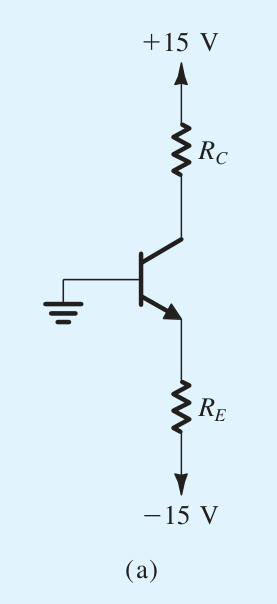

# 控制一个三极管的集电极输出

## 题干

给定下面的一个电路图

已知电路中的BJT管处于放大模式,$\beta=100$,当$i_{c}=1\text{mA}$时,$v_{BE}=0.7\,\text{V}$,试设计确定电路中的电阻$R_{C},R_{E}$,使得通过集电极的电流为$2 \text{mA}$,集电极的输出电压为$5 \text{V}$.

## 思路

首先我们先控制输出的电压$v_{c}$,因为给定的电压的上端是$15 \text{V}$在控制着,又因为集电极的电流是$2\text{mA}$,因此我们可以很快地决定出$R_{c}$的阻值.

$$
R_{c}=\frac{15\text{V}-5\text{V}}{2\text{mA}}=5\text{k}\Omega
$$

接下来就是处理$R_{E}$了,因为我们有
$$
i_{E}=(\frac{1}{\beta}+1)i_{c}
$$
因此我们有
$$
i_{E}=2.02 \text{mA}
$$
现在我们求$V_{BE}$的电压大小,$V_{BE}$并不是守恒的,但是假如给定我们一个基准的电压和集电极电流$v_{0},i_{c0}$,我们会有如下的关系
$$
v_{be}=v_{0}+v_{T}\ln \frac{i_{c}}{i_{c0}}
$$
因为一般取$v_{T}=26\text{mV}$,因此
$$
v_{be}=700\text{mV}+26\ln(2)\approx 718\text{mV}
$$
因此我们可以计算出此时的电阻
$$
R_{E}=\frac{-v_{be}-v_{below}}{i_{e}}\approx  7.07 \text{k}\Omega
$$
