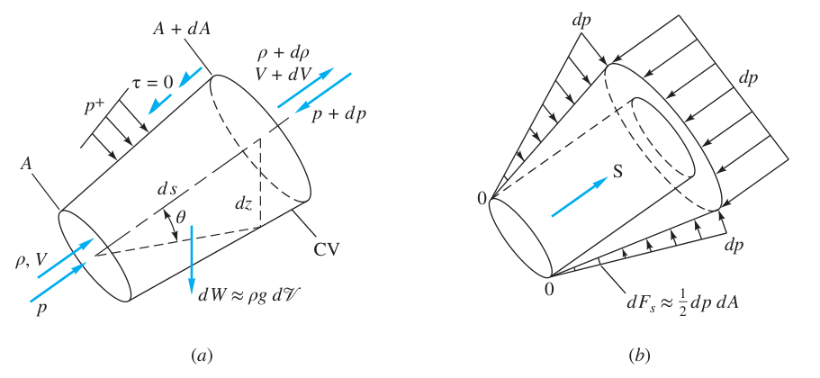
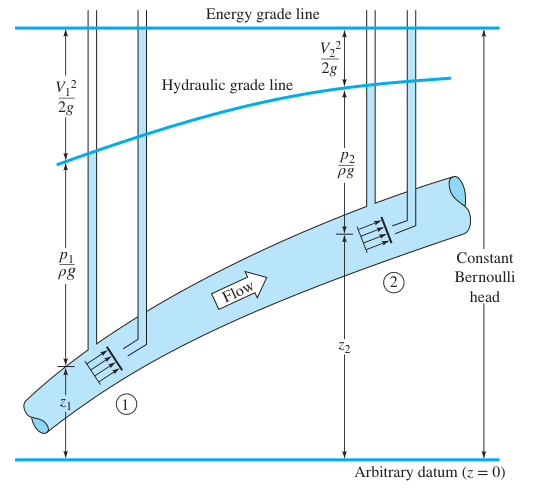

# 流体力学(05):关于流体的积分关系(中篇)

## Reynolds 输运定理的导出

所有和质量的有关的量都是广延量,而与质量独立的量都是强度量，所有的广延量/质量都是强度量.这点我们在大学物理中介绍过,这里不再介绍.  
之所以重申上面的内容,是因为我们遇到了问题.对流体运动的研究必须使用**Eulerian 观点**,但是到现在我们的力学研究对象和导出的物理量都是处在**Lagrangian 观点**下的,我们需要一个转换观点的桥梁,这就是 **Reynolds 输运定理**.
桥梁式的公式是优雅的,但是肯定是推导困难的.如果你没有什么耐心,记下下面这些(可能是复杂的)公式是你的选择,如果你还有一些空闲,可以一起推导,理解下面的内容

对于**Lagrangian 观点**下的某个广延物理量$N$(**此时他是一个关于$t$的单值函数**),在经过了一个无穷小的时间间隔$dt$之后,它发生了一定程度的变化$dN$.从高等数学的知识我们可以知道,它的变化率是上面两个微分量的比(我学数学的人格可能会红温,但是我们不去管他)

$$
\frac{dN}{dt}
$$

现在我们换**Eulerian 观点**来认识一下上面发生的情况.首先**Eulerian 观点**要选一个控制体 CV 和一个控制面 CS,假设我们已经选好了,在这样的一个微小的时间$dt$当中,实质上广延量(**此时它不是关于$t$的单值函数**)由$t$时刻的情况$N_{t}$,转变为$N_{t+dt}$了.与此同时,有一部分流体离开了控制体,对我们的广延量造成了$dN_{out}$的影响,有一部分进入了控制体.对我们的广延量造成了$dN_{in}$的影响.由于通量的定义,进负出正,那么可得变化率的表达:

$$
\frac{N_{t+dt}-N_{t}-dN_{in}+dN_{out}}{dt}
$$

拆开上面的微分,由于广延量不完全是$t$的单值函数,更标准的写法应当是偏微分

$$
\frac{\partial N_{CV}}{\partial t}+\frac{\partial N_{net}}{\partial t}
$$

上面这个东西自然就等于我们在讨论**Lagrangian 观点**时的变化情况等价,因而:

$$
\frac{dN}{dt}=\frac{\partial N_{CV}}{\partial t}+\frac{\partial N_{net}}{\partial t}
$$

这其实已经完成了桥梁的搭建了.只是...这个公式完全没解释后面两个导数咋算,因此我们还得把它继续转化成我们已经声明过的物理量和数学量.由于我们讨论的是广延量,自然就会想把体积搞出来嘛.假设$N$所对应除去质量的强度量叫$\eta$.那么自然就会有

$$
N_{CV}=\eta m_{CV} =\eta \rho V_{CV}=\eta \rho \iiint_{CV} dV
$$

而进出的变化量就是通过两截面广延量的净通量嘛,上面刚说过体积流率的事情

$$
\frac{\partial N_{net}}{\partial t}=\iint_{CS}\eta \rho (\vec{v}_{net\,CS}\cdot \vec{n})dA
$$

因此我们得到 **Reynolds 输运定理的一般形式**

$$
\color{Red}{
{\frac{dN}{dt}=\frac{\partial }{\partial t}\iiint_{CV} \eta \rho dV+\iint_{CS}\eta \rho (\vec{v}_{net\,CS}\cdot \vec{n})dA}}
$$

前者由广延量的两个时刻的稳态决定,因而也叫**稳态项**,后者是在这个瞬间上两截面的通量,一般称之为瞬态项.

## Reynolds 输运定理的孩子们(上)

### 质量守恒定律的积分形式:连续方程

假如我们让上述的广延量$N=m$,我们就得到了流体的**质量守恒定律**

$$
\frac{dm}{dt}=\frac{d }{dt}\iiint_{CV}  \rho dV+\iint_{CS} \rho (\vec{v}_{net\,CS}\cdot \vec{n})dA
$$

由于我们先前讨论过系统微元的质量不发生改变,所以质量守恒定律可以写成如下的**积分形式**

$$
\color{Gold}{
\frac{d }{dt}\iiint_{CV}  \rho dV+\iint_{CS} \rho (\vec{v}_{net\,CS}\cdot \vec{n})dA=0}
$$

上面的方程一般被我们叫做**连续方程**.
如果我们的控制体的体积不发生改变,那么上面的连续方程还能进一步地简化,只要将微分号移入积分中即可:

$$
\iiint_{CV}\frac{
    \partial \rho}{\partial t}   dV+\iint_{CS} \rho (\vec{v}_{net\,CS}\cdot \vec{n})dA=0
$$

我们还可以进一步简化,假设我们选定的控制体有且仅有有限个一维出入口,自然就会得到

$$
\iiint_{CV}\frac{
    \partial \rho}{\partial t}   dV+\sum_{i}(\rho_{i}A_{i}v_{i})_{out}-\sum_{i}(\rho_{i}A_{i}v_{i})_{in}=0
$$

再进一步简化,假设流体的是**定常流动**,即$\frac{\partial \rho}{\partial t}\equiv 0$,则稳态项$\displaystyle \iiint_{CV}\frac{
    \partial \rho}{\partial t}   dV$的贡献为$0$,因此

$$
\sum_{i}(\rho_{i}A_{i}v_{i})_{out}=\sum_{i}(\rho_{i}A_{i}v_{i})_{in}
$$

我们在开头刚刚讲过$\rho A v$就是质量流率,则有

$$
\sum_{i} \dot{m}_{in}=\sum_{i} \dot{m}_{out}
$$

下面的补充包介绍了几个上述的实例:[连续方程实例]

### 动量定律的积分形式:动量方程

类比来看,假如我们不取$N=m$,而是取$N=\vec{p}$.则此时我们的强度量$\eta$就必须按如下形式计算:

$$
\eta=\frac{\vec{p}}{m}=\vec{v}
$$

将上面的内容带入 Reynolds 输运定理,得到

$$
{\frac{d\vec{p}}{dt}=\frac{\partial }{\partial t}\iiint_{CV} \vec{v} \rho dV+\iint_{CS}\vec{v}\rho (\vec{v}_{r}\cdot \vec{n})dA}
$$

其中$\vec{v}$是流体的**绝对速度**,而$\vec{v_{r}}=\vec{v}-\vec{v_{CS}}$称为流体相对控制面的**相对速度**,只有在流体和流体面之间有相对运动的条件下,流体才会发生动量的变化.而由我们先前介绍的牛顿第二定律,动量对时间的一阶导数就是流体受到的合外力,因而上面的式子应当写成如下的形式

$$
\color{Green}{\sum \vec{F}=\frac{\partial }{\partial t}\iiint_{CV} \vec{v} \rho dV+\iint_{CS}\vec{v}\rho (\vec{v}_{r}\cdot \vec{n})dA}
$$

上面推导出的内容称之为**流体的动量方程**,当然,更多时候我们会写成三维方程组的形式,这是完全等价的.  
假如我们取出的控制体是固定不动的,那么此时$\vec{v_{r}}=\vec{v}-\vec{v_{CS}}=\vec{v}$,因此上式就会变成

$$
\boxed{
\sum \vec{F}=\frac{d }{d t}\iiint_{CV} \vec{v} \rho dV+\iint_{CS}\vec{v}\rho (\vec{v}\cdot \vec{n})dA}
$$

我们沿用研究质量律的研究方法,假如此时我们在讨论一维截面的流动,那么后面的通量就可以写成两个和的形式

$$
\sum \vec{F}=\frac{d }{d t}\iiint_{CV} \vec{v} \rho dV+\sum_{i}(m_{i}v_{i})_{out}-\sum_{i}(m_{i}v_{i})_{in}
$$

### 动量方程的重要推论:Bernoulli 方程

#### Bernoulli 方程的导出

现在我们利用动量定理来导出 **Bernoulli 方程**.假设给定如下图所示的一个管路

假设管路的内流体的基本属性$\rho,V,p$随着$s$的不同而发生着变化,但是在同一截面$A(s)$上的属性完全相同,流管有一给定的倾角$\theta$,因此,我们能找出高度变化和流经路径的关系

$$
dz=ds\sin \theta
$$

假设我们不计管路和流体之间的摩擦,此时流体会发生什么呢?对流体列质量方程和动量方程.首先看质量方程

$$
\frac{d}{dt} \left( \int_{CS
} \rho \, dV \right) + \dot{m}_{\mathrm{out}} - \dot{m}_{\mathrm{in}} = 0 \approx \frac{\partial \rho}{\partial t} \, dV + d\dot{m}
$$

因此,上面可得

$$
d\dot{m}=-\frac{\partial \rho}{\partial t} \, Ads
$$

这个方程对一切管流都成立,管路是否无摩擦不造成影响.现在我们来看动量方程

$$
\sum\!dF_s = \frac{d}{dt}\left(\int_{\mathbb{C}\mathbb{V}} V\rho~dV\right) + (\dot{m} V)_{\rm out} - (\dot{m} V)_{\rm in} \approx \frac{\partial}{\partial t}\left(\rho V\right)A~ds + d(\dot{m} V)
$$

现在在我们来看$\sum dF_{s}$的情况,这里用到了无摩擦的条件.因为没有摩擦,所以合外力仅由外压和流体本身所受的重力贡献.流体的重力如下表示

$$
d{F_{g}}=-dW\sin\theta=-\gamma Ads\sin\theta=-\gamma A dz
$$

而外压的情况更加直观一点

$$
dF_{s}\approx -A dp
$$

因此我们可以得出

$$
\sum dF_{s}=-A dp-\gamma A dz
$$

因此联立上述方程

$$
-A dp-\gamma A dz=\frac{\partial}{\partial t}\left(\rho V\right)A~ds + d(\dot{m} V)
$$

展开后式,得到

$$
-A dp-\gamma A dz=\frac{\partial \rho}{\partial t} VA \, ds + \frac{\partial V}{\partial t} \rho A \, ds + \dot{m} \, d\vec{v} + \vec{v} \, d\dot{m}
$$

第一项和最后一项利用先前的质量方程推导出的关系可以抵消

$$
-A dp-\gamma A dz=\frac{\partial V}{\partial t} \rho A \, ds + \dot{m} \, d\vec{v}
$$

同除$\rho A$,得到

$$
\frac{\partial V}{\partial t} \, d\vec{s} +gdz+\frac{dp}{\rho}+\vec{v}d\vec{v}=0
$$

上面这个方程就是所谓的伯努利方程,那为什么和书上的长得不一样呢??这是因为我们在讨论的是一般的非稳态流动的情况.现在假设我们正在考虑稳态不可压缩流的情况,那么第一项就是 0,而密度是一个常值,应当写成

$$
\color{red}{g(z_{2}-z_{1})+\frac{p_{2}-p_{1}}{\rho}+\frac{1}{2}(v_{2}^{2}-v_{1}^{2})=0}
$$

这个时候和书本上的就已经很像了,想要写成书本上的形式只需要将$1$的项目和$2$的项目分列在等号两边即可,即

$$
\frac{p_{1}}{\rho}+\frac{1}{2}v_{1}^{2}+gz_{1}=\frac{p_{2}}{\rho}+\frac{1}{2}v_{2}^{2}+gz_{2}=\text{const}
$$

上面的方程其实我们在热力学中也有所涉及,上面的三个分量分别单位质量是**压强势能,动能和重力势能**,因此我们可以得出,**Bernoulli 原理也是另一种形式的能量守恒**.为什么只要考虑这三种能量呢,废话!因为就只有重力,压力和流体的运动在这个系统中被我们考虑了呀(笑)

#### Bernoulli 方程的基本推论

我们可以观察到,如果把伯努利方程两边同时除去$g$,那么两边的量纲都会统一成$[L]$,因此,我们常常也把它写成这样的形式

$$
\frac{p_{1}}{\rho g}+\frac{1}{2g}v_{1}^{2}+z_{1}=\frac{p_{2}}{\rho g}+\frac{1}{2g}v_{2}^{2}+z_{2}=H
$$

我们一般叫$H$为流体的**总水头**(Water Head).可见,无摩擦的不可压缩流体的定常流动过程的水头是不变的.我们可以由**水力线图**来描述上面的事实和水头的变化

如果我们现在不考虑位置势能带来的印象,那么上面的方程可以写成

$$
\frac{p_{1}}{\rho }+\frac{1}{2}v_{1}^{2}=\frac{p_{2}}{\rho }+\frac{1}{2}v_{2}^{2}
$$

两边同时消去$\rho$,得到的物理量量纲为$[\text{ML}^{-1}\text{T}^{-2}]$,因此可以取其为一压强$p_{stag}$

$$
\frac{p_{1}}{\rho }+\frac{1}{2}v_{1}^{2}=\frac{p_{2}}{\rho }+\frac{1}{2}v_{2}^{2}=p_{stag}
$$

此时我们叫$p_{stag}$为**滞止压强(stagnation pressure)**.
它在我们的[Pitot 管实例]中起到了重要的作用,与此同时,上面的内容也能帮我们更好地认识[Venturi 管].

