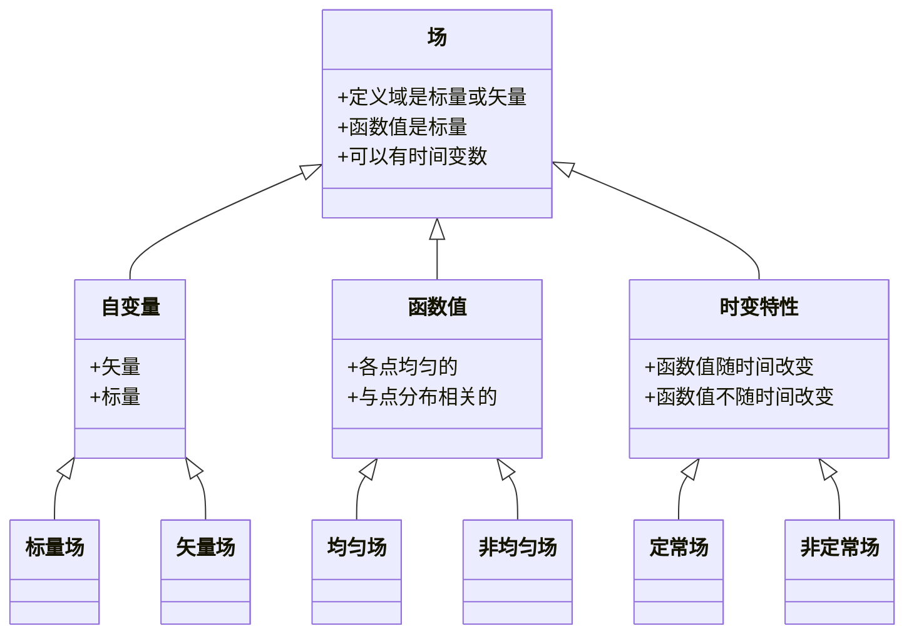

# 流体数学工具:场论(1)

## 场论

### 场是什么

场就是**空间内函数**.  
场根据函数描述对象的不同有所分类,如下图所示

### 标量场的几何描述:等势面

现在给定一个标量场$\varphi(r,t)$,我们描述这个场的方式是:

- 固定时间变数为$t_0$
- 寻找满足$\varphi(r,t_{0})=\varphi_{0}$的所有点

这样由等势点构成的曲面称之为**等势面**,这个标量函数一般称之为**势函数**.  
等势面越密,函数在某一个固定面积的区域内的变化就越快.与此同时,它还有一些重要的应用需要了解:

- 等压线
- 等温线
- 电势的等势线

### 矢量场的几何描述:矢量线

我们现在来描述矢量场的几何情况.由矢量的定义,我们有:

- 矢量
  - 大小
    - 利用等势面
  - 方向
    - 利用**矢量线**

现在我们来理解下矢量线,它是经过场内各个点的**曲线族**,并且满足**过场内所有点的矢量方向与矢量线处处相切**.

怎么样去描述一个矢量线呢??取场内的某一个向量,任意取,自然我们可以取到$\vec{a}$,它一定和此时矢量线通过该点的线微元平行(这是由于相切的定义).描述两个向量平行,最简明的方法是通过矢积:

$$
\vec{a}\times\mathrm{d}\vec{r}=0
$$

我们拆开上面的矢积:

$$
\begin{vmatrix}
    \vec{i} &\vec{j}&\vec{k}\\\\
    a_{x} & a_{y} & a_{z}\\\\
    \mathrm{d}x &  \mathrm{d}y & \mathrm{d}z
\end{vmatrix}=0
$$

自然地,如果要使得上面的行列式每时每刻都为0,只能是非基向量的那两行处处对应成比例,即:

$$
\frac{\mathrm{d}x}{a_{x}(x,y,z,t)}=\frac{\mathrm{d}y}{a_{y}(x,y,z,t)}=\frac{\mathrm{d}z}{a_{z0}(x,y,z,t)}
$$
