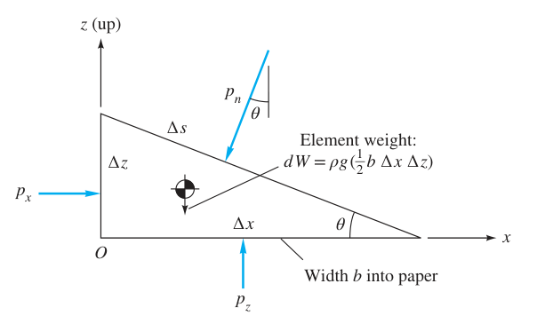
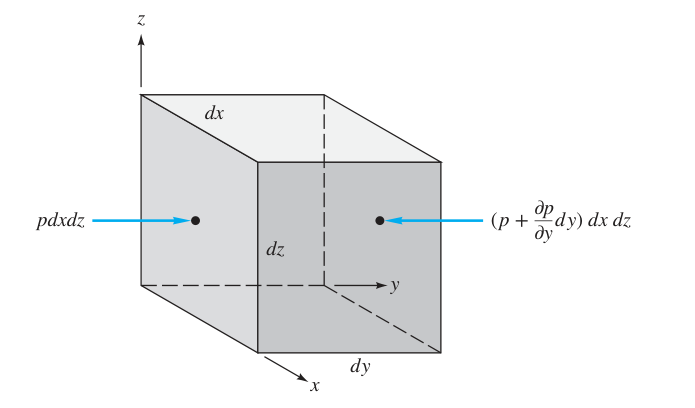
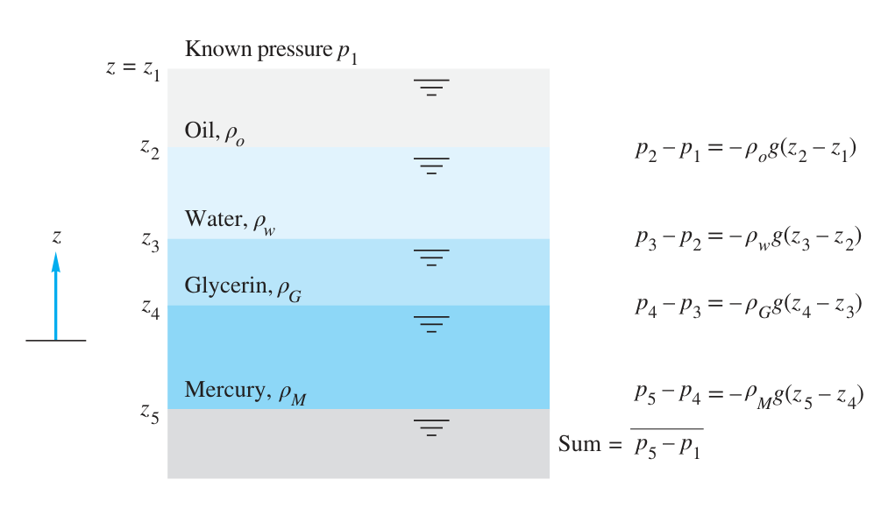

# 流体力学(02):流体静力学的基础理论

## 无重力情况下压力场的分布

### 压强

无重力情况下的条件可以帮助我们得到如下的定理:

??? ad-note "流体基本定律"
    流体内的任何一点的压强是各向均等的.并且流体各点的压强是相同的.

我们是可以证明上面的定理,我们先从我们的流体中取出一个小块来研究其受力:

对于如图所示的单元,假定$P_{x},P_{z},P_{n}$不相同,那么自然我们考虑微元的平衡关系
$$
\begin{equation}
    \begin{cases}
    \sum F_{x}=0 \\\\
    \sum F_{z}=0
    \end{cases}
\end{equation}
$$
从而得到:
$$
\begin{equation}
    \begin{cases}
p_{x}b\Delta z-p_{n}b\Delta s \sin \theta=0 \\\\
p_{z}b\Delta x-p_{n}b\Delta s \cos\theta-\frac{1}{2}\rho g b\Delta x\Delta z=0
\end{cases}
\end{equation}
$$
由几何关系$\Delta z=\Delta s \sin \theta,\Delta x=\Delta s \cos \theta$,将$\Delta s$替换掉,可以得到
$$
\color{blue}
\begin{cases}
p_{x}=p_{n} \\\\
p_{z}=p_{n}+\frac{1}{2}\rho g \Delta z
\end{cases}
$$
我们考虑替换$\Delta z$为$dz$,因此,此时三角微团就会不断减小,此时对于这样一个小点,
$$
p_x=p_n=p_{z}=p
$$
所以我们可以把对点的压强统一为$p$,因此,$p$是关于流体内点的函数$p(x,y,z,t)$,与定向无关.

### 关于压强梯度,流体的牛顿第二定律关系

现在我们研究如图所示的一个流体微团.我们只考虑平行于$y$的情况.
自然地,左侧面的微元**压力大小**设为$pdxdz$,那么自然,右侧就是
$$
pdydz+\frac{{\partial p}}{\partial x}dxdydz+\frac{{\partial p}}{\partial y}dxdydz+\frac{{\partial p}}{\partial z}dxdydz
$$
对于平行于$y$的情况,$\frac{{\partial p}}{\partial x}=0,\frac{{\partial p}}{\partial z}=0$,因此右侧就是
$$
\left(p+\frac{{\partial p}}{\partial y}dy\right)dxdz
$$
两者的压力大小差就是
$$
 dF_{y}=-\frac{{\partial p}}{\partial y}dxdydz
$$
自然地,我们也可以对$x,z$两轴做相同的事情,它们的地位是等价的,得到
$$
\color{orange}
\begin{cases}
d F_{x}=-\frac{{\partial p}}{\partial x}dxdydz \\\\
d F_{y}=-\frac{{\partial p}}{\partial y}dxdydz \\\\
d F_{z}=-\frac{{\partial p}}{\partial z}dxdydz
\end{cases}
$$
那么流体微元总共受到的压力的大小就是
$$
d F_{p}=-(\frac{{\partial p}}{\partial x}+\frac{{\partial p}}{\partial y}+\frac{{\partial p}}{\partial z})
dxdydz$$
现在我们引入方向,这是容易的,只要在各轴分量上乘上对应的单位正交基就可以了.
$$
d \hat{F_{p}}=-(\frac{{\partial p}}{\partial x}\hat{i}+\frac{{\partial p}}{\partial y}\hat{j}+\frac{{\partial p}}{\partial z}\hat{h})dxdydz
$$
我们利用高数知道的公式,就可以得到
$$
d \hat{F_{p}}=(-\nabla{p})dxdydz 
$$
此时我们定义单位体积下的体积作用压力为$f$
所以
$$
\color{pink}
\hat{f_{p}}=-\nabla p
$$
也就是说,我们认为单位体积压力是压强的负梯度.
那么我们对于流体可以列出这样的这样的牛顿第二定律
$$
\textcolor{pink}{\hat{f_{p}}}+\textcolor{orange}{\hat{f_{grav}}}+\textcolor{blue}{\hat{f_{visc}}}=\frac{m}{V}\hat{a}
$$
那么我们自然有$\rho=\frac{m}{V}$
所以我们就有:
$$
\textcolor{pink}{\hat{f_{p}}}+\textcolor{orange}{\hat{f_{grav}}}+\textcolor{blue}{\hat{f_{visc}}}=\textcolor{green}{\rho\hat{a}}
$$
## 仅重力作为外力的流体静力学状态

### 力学分析
在静力学状态,此时流体仅受重力作用,无加速度也无粘性作用,那么由我们上一个公式,**并选取上为正**:
$$
\nabla p=\rho \hat{g}=-\gamma \hat{k}
$$
所以我们将上面的梯度方程展开为方程组,约去单位矢量.
$$
\begin{cases}
\frac{{\partial p}}{\partial x}=0 \\\\
\frac{{\partial p}}{\partial y}=0 \\\\
\frac{{\partial p}}{\partial z}=-\gamma
\end{cases}
$$
从而得到
$$
p_{2}-p_{1}=-\int^{2}_{1}\gamma dz=\gamma(z_{1}-z_{2})
$$

众所周知$z_{1}-z_{2}=\Delta h$
所以我们可得:
$$
\color{green}
\Delta p=\rho g\Delta h
$$

### 液体的压力分布

由于液体的压缩属性很差(即几乎不能压缩),因此液体的密度$\rho_{l}$基本处处均等,此时$\rho_{l}=C$.所以我们认为,对于静液体而言:
$$
p_{2}-p_{1}=-\int^{2}_{1}\gamma dz=\gamma(z_{1}-z_{2})
$$

为了方便计算,将$\frac{p}{\gamma}$定义成一个新的物理量,称为**静压头**,他的量纲是$[L]$.

#### 水银计模型(托里拆利实验)

![[Pasted image 20250306104608.png|550]]

上面的模型是一个水银气压计的模型,它脱胎自托里拆利完成的实验,顶端是真空.由我们上面的公式:

$$
h=\frac{p_{a}}{\gamma _{M}}
$$
只要我们测定一般状态下的$\gamma_{M}$,我们就能获得现在的大气压.

### 等温静气体分布

我们还是由上面的公式:
$$
\frac{dp}{dz}=-\rho g
$$
因为流体是可压缩的,所以我们不再能将密度作为常值了.
此时我们应当使用理想气体模型,我们认为此时气体是等温的:
$$
p=\rho RT
$$
所以我们可以写出:
$$
\frac{dp}{dz}=-\frac{p}{RT}g
$$
所以自然地我们写出
$$
\frac{dp}{p}=-\frac{g}{RT} dz
$$
两边同时积分
$$
\ln\left( \frac{p_{2}}{p_{1}} \right)=-\frac{g}{RT}(z_{2}-z_{1})
$$
将对数去掉
$$
\color{orange}
p_{2}
=p_{1}\exp\left( -\frac{g(z_{2}-z_{1})}{RT}  \right)
$$
#### 大气压测定

实际上我们的大气并不是等温的(悲),他应该近似是一个线性的关系:
$$
T\approx T_{0}-Bz
$$
其中$T_{0}$是海平面气温,$B$是一个比例系数,称为**气温垂直递减率**.国际上一般取:
$$
\begin{cases}
T_{0}=15 ^\circ \text{C}=288.15 \text{K} \\
B=0.00650 \text{K/m}
\end{cases}
$$
有了上面的公式,我们就要修正上面的等温气压模型,实际上,我们得到:
$$
\begin{cases}
p=p_{a}\left( 1-\frac{Bz}{T_{0}}\right)^{g/(RB)} \\
\rho=\rho_{0}\left(1-\frac{Bz}{T_{0}}\right)^{(g/(RB))-1}
\end{cases}
$$

对于气体而言,除非$\delta z$很小,不然线性关系$\delta p\approx -\gamma dz$一般是不成立的.所以你是不能用液体的那个$\rho gh$的公式的.

## 液压计与Pascal定律
首先我们先关注不同分层液体的压强问题,如下图所示:

如图所示,假设我们想求$p_{5}$,那么我们其实就只要把每一个液体加上的压强叠加起来就可以了.
$$
p_{n}-p_{1}=-\sum_{i=1}^{n}\rho_{i}g(z_{i+1}-z_{i})
$$
由于我们总是取上为正方向,所以其实$z_{i+1}-z_{i}<0$恒成立,根据这样的判断,$p_{n}\geq p_{1}$,即越深的液体压强越大,这和我们的生活经验和实验是吻合的.
现在我们来看一个简单的测压计模型
![[Pasted image 20250306162613.png]]
如图所示,$p_{a}$是我们已知的$A$气体压强,自然地我们用刚才的认识,可以得到:
$$
p_{a}=p_{A}+\gamma_{1}|z_{1}-z_{a}|-\gamma_{2}|z_{2}-z_{1}|
$$
之所以可以列出这样的式子,是因为我们发现在$p_{2}$当中,液面先下降了$z_{1}-z_{D}$,又上升了$z_{1}-z_{D}$,所以实质上压强没变.我们可以抽象出深刻的定则
??? ad-note "Pascal 原理"
    对于**同种连续**液体而言,同样高度的液面压强一定相同.

当中的重点是同种和连续,如果当中有真空或者气泡是决计不能用帕斯卡定理的,就要考虑气体的压强变化了.
### 液压计变体
除了上面的气压计,我们还有很多气压计变体,放在实例当中.
