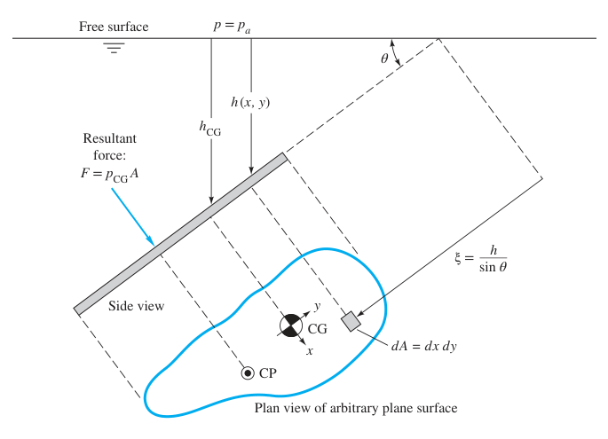

# 流体力学(03):面流体静力学,浮力浮体稳定问题和刚体运动下的压力分布

## 对平面之力

我们现在推导对平面之力,在现在的推导中,我们先认为我们的流体是密度分布均匀的.  

### 水平面

水平面是最方便的,因为我们受到的压力就是垂直于受力面并指向受力面,所以我们的这个时候就可以直接上$p=\gamma H$($H$是水深).假设平面的面积是$A_b$,那么我们就可以求到此时的受力
$$
F=\gamma A_{b} H
$$
此时整个版面的每一个质点受到的压力都是完全相同的,所以完全可以将其转化成对质点中心的力和力矩.

### 并非水平

#### 压强公式

现在我们来研究并非水平浸在水中的面的压力,如下图所示:

假设平面和水平面/自由面成$\theta$的角.那么此时我们就会有受力作用,我们将它们等效为作用在压力中心(CP)上的力$F$,并且我们认为:
$$
F=p_{CG}A
$$
为什么是等价于施加在重心上的压强呢?我们来作如下的推导

#### 推导

对于此时的平面,取一小微元,其面积$\xi=\frac{h}{\sin\theta}$(因为这时候真的和线没区别),于此同时,这个不规则平面的压强总是可以写成下面的积分形式

$$
F_{CP}=\int p\ dA
$$

那么自然地我们就要求$p$的表达式了,对于浸入水中的$p$,由于我们假定流体是均质的,所以自然有:
$$
p=p_a+\gamma h
$$
那么我们就可以解出该积分:
$$
F=p_a A+ \gamma\int h\ dA=p_a A+\gamma\sin \theta\int \xi\ dA
$$
由我们已经学过的形心(均质条件下重心即形状重心)公式:
$$
\xi_{CG}=\frac{1}{A}\int \xi\ dA
$$
所以自然可得
$$
\color{green}{F=p_a A+\xi_{CG}A\gamma\sin \theta=A(p_a+h_{CG}\gamma)}
$$
因而
$$
\color{skyblue}
{F=p_{CG}A}
$$

#### 为何不通过形状重心

实验表明,我们的压强等效力并不是作用在形心(重心)上,而是要更加偏向深水的一侧.我们把它叫做**压力中心**(CP).

我们现在来推导压力中心的位置,这是通过**力矩平衡**来实现的,我们设均匀平面的形心是我们的参考点,并以这个参考点构建$xy$坐标系.我们现在来求压力对整个平面的力矩,从总压力本身的视角来看:
$$
I_{F}=F\cdot y_{cp}
$$
其中$y_{cp}$即我们待求得压强重心到参考点(即形心)的距离,即坐标.  
于此同时,我们的力矩从压强的视角去看,是压强对每个面微元的压力造成的力矩微元的总和构成了上面总压力的力矩,它们应该是严格相等的,而力矩微元又可以表示成微元乘积的形式,综上可得:  
$$
F\cdot y_{cp}=I_{F}=\int yp\,dA
$$
前半段没什么好处理的了,我们着手处理后面的积分,首先,替换我们的虚拟变量,$p=p_{a}+\gamma h_{\xi}=p_{a}+\gamma\xi \sin \theta$,以防遗忘,$p_{a}$是我们自由面的压强.  
然后我们大胆地作拆分,将积分写成下面的形式:
$$
I_{F}=\int y(p_{a}+\gamma\xi \sin \theta)\,dA=\int yp_{a}\,dA+\gamma\sin \theta\int y\xi \,dA
$$
前面这个积分是什么?是自由面上点的力矩!自由面上都没有我们的面元, **何来压力?何来力矩?** 自然可得力矩为0.因而:  
$$
I_{F}=\gamma\sin \theta\int y\xi \,dA
$$
此时我们的积分中还是有一个虚拟变量$\xi$,我们希望可以利用已知的$\xi_{CG}$去做代换,即$\xi=\xi_{CG}-y$:
$$
I_{F}=\gamma\sin\theta\left(\xi_{CG}\int y\,dA-\int y^{2}\,dA \right)
$$
我们现在回到工程力学中所学质心的公式:
$$
y_{CG}=\frac{\int y\,dA}{\int dA}
$$
由于我们定义了$y_{CG}\neq 0$,在$\int dA\neq 0$的情况下,必然有
$$
\int y \,dA=0
$$
我们再可以由力学知识得到$\int y^{2}\,dA$是面积对$x$轴的惯性矩$I_{xx}$
所以上面的积分继续简化:
$$
I_{F}=-\gamma \sin \theta I_{xx}
$$
可曾记得我们还有一个关于总压力的关系?
$$
I_{F}=F\cdot y_{cp}
$$
我们已知$F=p_{CG}A$,自然移项可得$y_{cp}$
$$
\color{#E85642}{y_{cp}=-\gamma \sin \theta\frac{I_{xx}}{p_{CG}A}}
$$
对我们的$x_{cp}$我们用类似之做法
$$
Fx_{cp}=-\gamma\sin \theta \int xy \,dA
$$
因此我们有:
$$
\color{#17A1DE}
x_{cp}=-\gamma\sin \theta \frac{I_{xy}}{p_{CG}A}
$$

#### 实例

详见习题补充包[关于平面的问题求解]

## 对曲面之力

## 对层流之力

## 浮力与浮稳定问题

## 外界作刚体运动下的流体压力分布

