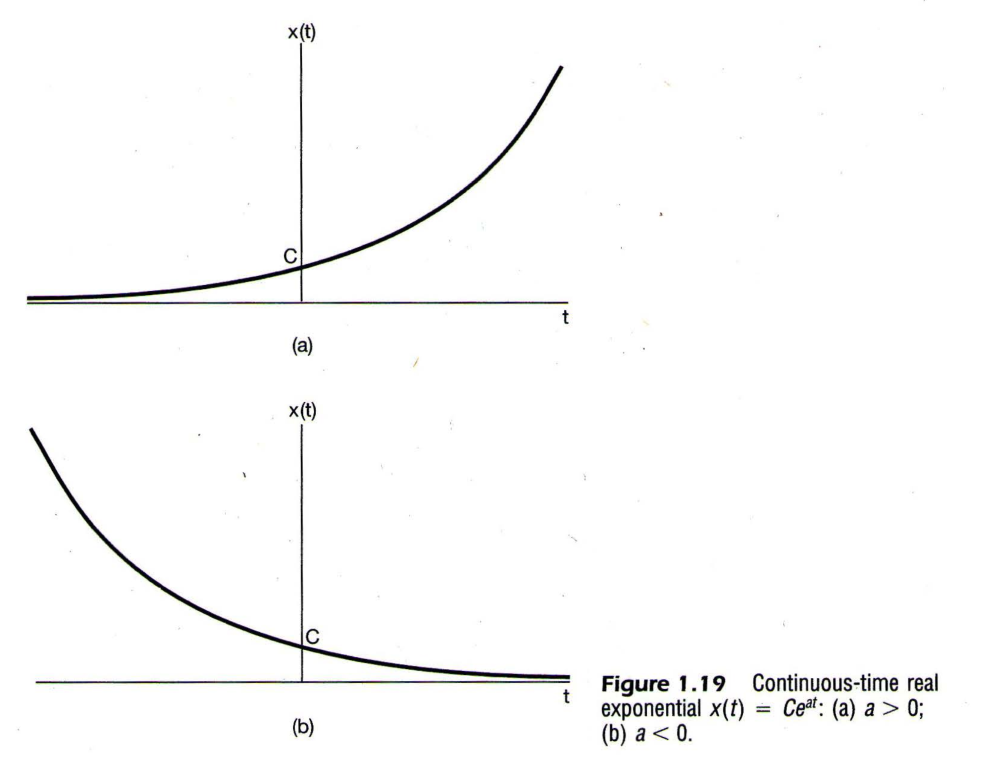
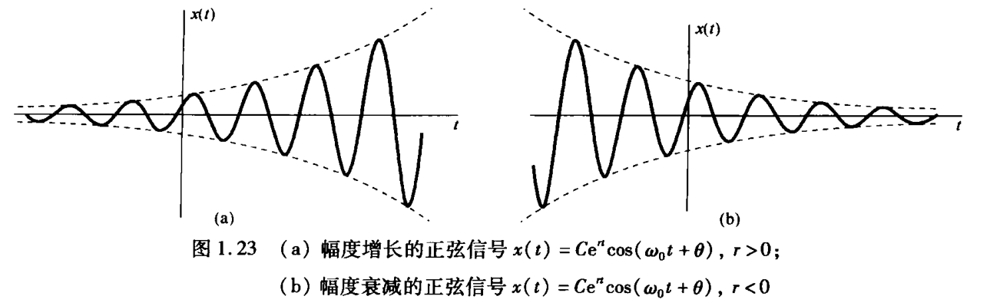

# 信号与系统

## 连续信号,离散信号,复信号

- 连续信号:连续的实变函数,记作$x(t)$
- 离散信号:定义域为整数集的实变函数,记作$x[n]$
- 复信号:复变函数

## 信号的能量:L2范数

一个给定信号的在某个区间上的能量,用它的L2范数来表示.对于连续时变信号来说:
$$
\int_{t_{1}}^{t_{2}}|x(t)|^{2}dt
$$
对于离散时变信号来说:
$$
\sum_{n=n_{1}}^{n_{2}}|x(n)|^{2}
$$

[关于求解信号能量的习题]

## 信号变换

### 反转变换

$$
R:f(x)\to f(-x)
$$
这样的变换被叫做**反转变换(Reverse)**.
两个互反的信号关于$y$轴对称.

### 时移变换

我们一般函数会在自变量的轴线上左右移动,这种行为一般叫做**时移(Time Shift)**.
$$
TS:f(x)\to f(x+x_{0})
$$
如果$x_{0}>0$那么就是向左移动,$x_{0}<0$那么就是向右移动(这就和函数移动是一样的).

### 尺度变换

现在我们来看尺度上的变换$S$

$$
S:f(x)\to f(sx)
$$
假如我们的$|s|>1$,那么自然就会有对信号的加速(或者另一种描述,信号长度的压缩).假如我们的$|s|<1$,那么自然就会有对信号的减速(或者另一种描述,信号长度的伸长).负号只是表示要不要对原信号反相.

### 周期信号

假如我们能找到一个正实数$T$.使得式子
$$
F(x)=F(x+T)
$$
成立,那么$T$叫做周期.其中的最小值叫做$T_{0}$,不是所有的周期信号都有最小正周期,比如常信号$f(x)=C,C\in \mathbb{R}$就没有最小正周期.

### 信号就是函数

从上面的介绍我们可以看出,**信号就是函数**.因而可以理解的是,上面的三个变换同样也可以对离散信号施加,达成的目的是完全相同的.不过,我们要指出,某些非周期的连续信号可以通过某些特殊的采样规则对应到一个具有周期性的离散信号.所以连续信号的周期性比离散信号更加严苛.

[关于信号变换的一些实例]

## 信号的奇偶性

### 奇偶性的定义

假如描述信号的函数是奇函数,那么我们就叫信号为**奇信号**,如果是偶函数,那么就叫做偶信号.这和我们的函数依然是统一的.

### 信号的奇部和偶部

之所以我们要介绍奇偶信号,是因为我们要对一般的信号加以分解.我们要介绍下面这个知名的定理:

!!! note 奇偶分解定理
    任何给定信号(以连续信号为例)$f(t)$,总是可以分解成一个奇信号和一个偶信号之和,即:
    $$
    f(t)=f_{O}(t)+f_{E}(t)
    $$

我们证明一下上面的定理:
注意到取$f(t)$的反信号可以解决我们的问题,这是因为:
$$
f(-t)=f_{O}(-t)+f_{E}(-t)=-f_{O}(t)+f_{E}(t)
$$
于是我们可以反向解出$f_{O},f_{E}$
$$
\begin{cases}
    f_{O}=\frac{f(t)-f(-t)}{2}\\\\
    f_{E}=\frac{f(t)+f(-t)}{2}
\end{cases}
$$
那么我们自然也就找到了这两个信号,我们把$f_{O}$叫做信号的**奇部**,把$f_{E}$叫做信号的**偶部**.
上面的情景可以无缝地适配到离散信号上.

## 基础信号介绍

下面我们来介绍两组常用的信号

### 第一组:复指数信号和正弦型信号

#### 连续的

现在我们取连续函数
$$
x(t)=C\exp(at)
$$
其中$C,a$是复数.
我们把这样的信号叫做**复指数信号**.我们下面不同的$C,a$取法作进一步分析.

##### 实数型指数信号

假如我们的$C,a\in \mathbb{R}$,那么这个时候的信号就是指数衰减/上升的,这取决$a$和$0$之间的大小关系,如果$a=0$,指数信号退化为常信号,当$a>0$时指数上涨,$a<0$时指数衰减,这一点和我们的实指数函数一样,不多解释了.

##### 纯虚数型指数信号

假如我们使得$C$是实数,$a$是纯虚数,那么我们将得到一种**纯虚数型指数信号**
一般我们先取$C=1$加以研究,之所以要研究这样的信号,是因为它是**具有周期性的信号**.我们来看下面进一步的分析:
$$
x(t)=\exp(j\omega t)
$$
其中$a=\omega t,\omega \in  \mathbb{R},j=\sqrt{-1}$.

$$
x(t+T)=\exp[j\omega (t+T)]
$$
由于指数和可以拆开,我们可以得到:
$$
x(t+T)=\exp(j\omega t)\cdot\exp(j\omega T)
$$
假定$T$是周期,所以只能有
$$
\color{red}{\exp(j\omega T)=1}
$$
我们可以考虑大名鼎鼎的**Euler公式**
$$
\exp(j\theta)=\cos(\theta)+j\sin(\theta)
$$
展开上面的方程:
$$
\cos(\omega T)+j\sin(\omega T)=1
$$
利用复变函数的知识:
$$
\begin{cases}
    \cos(\omega T)=1\\\\
    \sin(\omega T)=0
\end{cases}
$$
解上面的三角方程,伴随着$T>0$的限制条件.
$$
T=k\frac{2\pi}{|\omega|},k\in \mathbb{Z}
$$
由于我们要计算的是最小的正周期,所以取$k=1$即可.
$$
T_{min}=\frac{2\pi}{|\omega|}
$$
我们已经得出了函数的最小正周期,因而知道其是周期函数.而之所以是周期信号,是因为指数信号的周期性其实是由组成其的正余弦信号分量贡献的.

##### 一般指数信号(阻尼振荡)

现在我们来研究一般的连续指数信号:
$$
x(t)=C\exp(at)
$$
其中$a=s+j\omega$,$s,j\in \mathbb{R},C \in \mathbb{C}$
我们将所有的参数都写成实数参量的形式:
$$
x(t)=|C|\exp(j\phi_{c})\exp[(s+j\omega)t]
$$
交换一下得到:
$$
x(t)=|C|\exp(st)\exp[(j\phi_{c}+j\omega t)]
$$
因而可以写成:
$$
x(t)=|C|\exp(st)\exp[j(\phi_{c}+\omega t)]
$$
可以注意到,后面是一个纯虚信号,自然考虑展开:
$$
x(t)=|C|\exp(st) [\cos(\phi_{c}+\omega t)+j\sin(\phi_{c}+\omega t)]
$$
因而:
$$
x(t)=|C|\exp(st)\cos(\phi_{c}+\omega t)+j|C|\exp(st)\sin(\phi_{c}+\omega t)
$$
由于我们振幅实际上是一个实指数信号,我们所有能取到的值一定在$x(t)=\pm |C|\exp(st)$之间/在其上,使得这两个信号成为我们所描述信号的一个**包络线**,如下图所示:

这样的指数信号一般也被叫做**阻尼振荡信号**,它是一种很常用的信号.

##### 指数信号和正弦之间的转化

我们刚刚讲过是正余弦信号带来了纯虚指数信号的周期.实质上,**正余弦信号就是纯虚数指数信号的线性组合**.下面介绍它们互相转化的方法,这种转化法我们已经在介绍奇偶信号的内容中用过了.
我们知道:
$$
|C|\exp(j(\omega t+\phi))=|C| \left( \cos(\omega t + \phi) + j \sin(\omega t + \phi) \right)
$$
$$
|C|\exp(-j(\omega t+\phi))=|C| \left( \cos(\omega t + \phi) - j \sin(\omega t + \phi) \right)
$$
综合上面两个方程,我们可以分别求出正余弦信号的指数表达:
$$
\begin{cases}
    |C|\cos(\omega t + \phi)=\frac{1}{2}|C|(\exp(j(\omega t+\phi))+\exp(-j(\omega t+\phi)))\\\\
    |C|\sin(\omega t + \phi)=\frac{1}{2}|C|(\exp(j(\omega t+\phi))-\exp(-j(\omega t+\phi)))
\end{cases}
$$

#### 离散的

